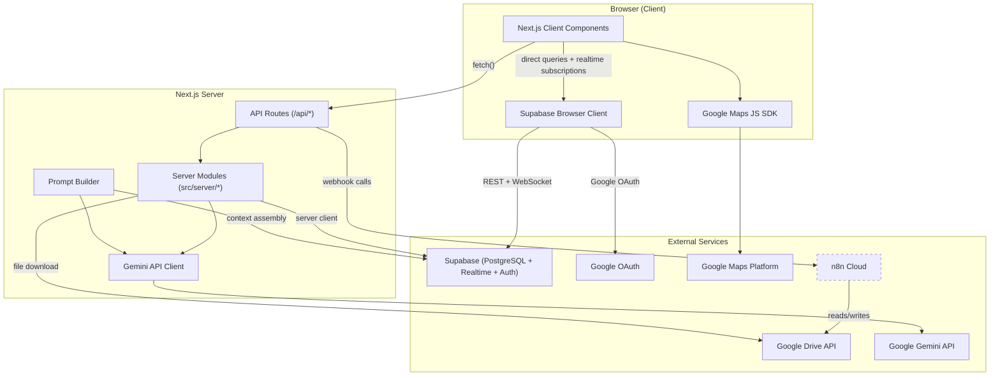
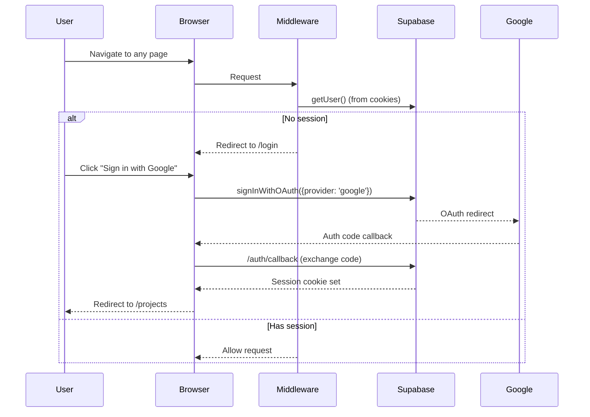

# Architecture Overview

## Tech Stack

| Layer | Technology |
|-------|-----------|
| Framework | Next.js 15 (App Router) |
| Language | TypeScript |
| Styling | Tailwind CSS |
| Database | Supabase (PostgreSQL + Realtime + Auth) |
| Auth | Google OAuth via Supabase Auth |
| Maps | Google Maps Platform (`@vis.gl/react-google-maps`) |
| AI / LLM | Google Gemini (`@google/genai`) |
| Embeddings | Gemini `text-embedding-004` (768-d vectors) |
| Vector Search | pgvector extension in Supabase |
| Automation | n8n (webhook-based, being phased out) |
| Package Manager | pnpm |

---

## System Diagram



> **Dashed border on n8n** = being phased out. Document processing and report generation now happen directly in the Next.js server.

---

## Where Data Lives

### Supabase (Primary Store)

All persistent project data lives in Supabase PostgreSQL. See [database-schema.md](./database-schema.md) for the full schema.

| Table | Purpose |
|-------|---------|
| `projects` | Project metadata, `folder_structure`, `spreadsheet_id` |
| `subject_data` | Subject core, taxes, parcels, improvements, `improvement_analysis`, FEMA, etc. (JSONB columns) |
| `comparables` | Individual comp records (Land, Sales, Rentals) |
| `comp_parsed_data` | AI-parsed comp payloads (`raw_data` JSONB) per comparable |
| `maps` | Map view state (center, zoom, drawings, overlays) |
| `map_markers` | Per-comp markers on maps (position, bubble, tail) |
| `page_locks` | Edit locking for concurrent users |
| `photo_analyses` | Subject photo metadata, AI labels, descriptions |
| `report_sections` | Generated report narrative content + embeddings |
| `report_section_history` | Version history for report sections |
| `project_documents` | Uploaded/ingested documents + AI extraction + embeddings |
| `knowledge_base` | Curated AI prompts/examples + embeddings |

### Google Drive (direct API + narrow n8n)

| Data | Format | Access Pattern |
|------|--------|---------------|
| Project root folders (picker) | Folder IDs under configured parent | `GET /api/projects/list-drive-roots` → `listFolderChildren` (user OAuth); parent from `GOOGLE_DRIVE_APPRAISAL_PROJECTS_PARENT_FOLDER_ID` |
| Subject photos | Image files in Drive folder | **Analysis:** n8n reads/processes → Supabase `photo_analyses`. **Previews / cover:** Next.js server uses Drive API with user OAuth |
| `input.json` | JSON in subject photos folder | `exportInputJson` writes via Drive API (`uploadOrUpdateFile`) for Google Apps Script |
| Comp folders | PDFs, images | List/metadata/download via `drive-api.ts`; parsing via `POST /api/comps/parse` (Gemini) |

### Google Spreadsheet (legacy comp / sheet workflows)

The spreadsheet still backs **optional** n8n routes (`comps-data`, `comps-exists`). Subject property data and rich comp payloads are primarily in Supabase (`subject_data`, `comp_parsed_data`); sheet integration is shrinking as the app owns more state in Postgres.

---

## Authentication Flow



**Key files:**
- `src/middleware.ts` — Checks auth on every request, redirects unauthenticated users to `/login`
- `src/components/SupabaseAuthProvider.tsx` — Client-side auth context, Google OAuth trigger
- `src/app/auth/callback/route.ts` — Exchanges OAuth code for session
- `src/app/login/page.tsx` — Login page UI

---

## Service Integration Map

### What Calls Supabase Directly (from browser)

The browser Supabase client (`src/utils/supabase/client.ts`) is used by:

| Hook / Module | Tables Accessed |
|---------------|----------------|
| `useProject` | `projects`, `comparables`, `maps`, `map_markers` |
| `useSubjectData` | `subject_data` |
| `useCompParsedData` | `comp_parsed_data` |
| `useProjectPhotos` | `photo_analyses` |
| `useReportSection` | `report_sections` |
| `usePresence` | `page_locks` + Supabase Realtime presence |
| `DocumentManager` | `project_documents` |
| `supabase-queries.ts` | All tables (CRUD + Realtime subscriptions) |

### What Calls Supabase from Server

Server Supabase client (`src/utils/supabase/server.ts`) is used by:

| Module | Purpose |
|--------|---------|
| `src/server/reports/actions.ts` | Read/write `report_sections`, `report_section_history` |
| `src/server/documents/actions.ts` | Read/write `project_documents` |
| `src/server/photos/actions.ts` | Read `photo_analyses`, export `input.json` to Drive, trigger n8n photo analysis |
| `src/lib/prompt-builder.ts` | Read `knowledge_base`, `projects`, `project_documents`, `photo_analyses`, `report_sections` |
| `src/app/api/seed/*` | Write `knowledge_base`, `report_sections` |

### What Calls n8n (Still Active)

| Entry point | n8n Endpoint | Purpose |
|-------------|-------------|---------|
| `POST /api/photos/process` | `/subject-photos-analyze` | Trigger photo analysis workflow |
| `POST /api/comps-data` | `/comps-data` | Load comps + image map from Spreadsheet (legacy) |
| `POST /api/comps-exists` | `/comps-exists` | Check if comp exists in Spreadsheet |

### What Calls Gemini Directly (No n8n)

| Module | Gemini Feature | Model |
|--------|---------------|-------|
| `src/lib/gemini.ts` | Report generation, document extraction, comp parsing | `gemini-2.5-flash-lite` (see `GENERATION_MODEL` in source) |
| `src/lib/embeddings.ts` | Text embeddings | `text-embedding-004` |
| `src/app/api/seed/backfill-reports` | PDF section extraction | Gemini multimodal via `gemini.ts` |

### What Calls Google Drive Directly

| Module | Purpose |
|--------|---------|
| `src/lib/drive-api.ts` | List folders, download/upload, metadata (user OAuth) |
| `src/lib/drive-download.ts` | Download files by ID for document processing |
| `src/lib/project-discovery.ts` | Discover project folder structure + spreadsheet candidates |
| `src/app/api/projects/list-drive-roots/route.ts` | List child folders of the configured appraisal-projects parent (new-project picker) |
| `src/lib/comp-parser.ts` | Download comp files and run Gemini extraction |
| `src/lib/engagement-parser.ts` | Parse engagement letters (upload or Drive file) |
| `src/lib/map-context.ts` | Register map screenshots as `project_documents` context |
| `src/lib/document-prompts.ts` | Type-specific extraction prompts |
| `src/lib/prompt-builder.ts` | Assemble report-generation context |
| `src/lib/embeddings.ts` | Embedding generation for RAG |
| `src/lib/supabase-queries.ts` | Shared server/client query helpers |
| `src/lib/improvement-analysis-populate.ts` | Subject improvement analysis helpers |

---

## Realtime Features

Supabase Realtime is used for live collaboration between users:

| Feature | Channel Type | What Updates |
|---------|-------------|-------------|
| Page locks | `postgres_changes` on `page_locks` | Lock/unlock editing per page |
| Photo grid | `postgres_changes` on `photo_analyses` | Live photo processing status, reordering |
| Report sections | `postgres_changes` on `report_sections` | Live content updates |
| Documents | `postgres_changes` on `project_documents` | Processing status updates |
| Presence | Supabase Realtime Presence | Who is on what page |

---

## Routing Structure

```
/login                          — Login page
/projects                       — Project list
/projects/new                   — Create project (Drive discovery + engagement parse + Supabase)
/restore                        — Migrate localStorage data to Supabase
/project/seed                   — Seed tools (knowledge base, backfill)

/project/[projectId]/           — Project dashboard
  ├── cover/                    — Cover page (print layout)
  ├── neighborhood/           — Neighborhood overview (map banner + narrative)
  ├── neighborhood-map/         — Full-screen neighborhood map editor
  ├── documents/              — Document manager (upload, AI extraction)
  ├── subject/
  │   ├── overview/             — Subject summary
  │   ├── improvements/       — Improvements + improvement analysis editor
  │   ├── location-map/         — Subject location map
  │   ├── photos/               — Subject photos (grid, labeling, AI analysis)
  │   ├── flood-map/            — Flood map viewer/context
  │   ├── sketches/           — Subject sketches
  │   └── cost-report/        — Cost report viewer
  ├── analysis/
  │   ├── zoning/               — Zoning narrative
  │   ├── ownership/            — Ownership history
  │   ├── subject-site-summary/ — Subject site summary
  │   └── highest-best-use/     — Highest & best use
  ├── land-sales/
  │   ├── comparables/          — Land comp list
  │   ├── comparables-map/      — Land comps map
  │   ├── ui/                   — Land comp UI template
  │   └── comps/[compId]/       — Land comp detail (+ location-map subroute)
  ├── sales/
  │   ├── comparables/          — Sales comp list
  │   ├── comparables-map/      — Sales comps map
  │   ├── ui/                   — Sales comp UI template
  │   └── comps/[compId]/       — Sales comp detail (+ location-map)
  └── rentals/
      ├── comparables/          — Rentals comp list
      ├── comparables-map/      — Rentals comps map
      ├── ui/                   — Rentals comp UI template
      └── comps/[compId]/       — Rental comp detail
```

### Notable shared components

| Component | Role |
|-----------|------|
| `DriveFolderBrowser` | Navigate Drive folders (multi-select in document flows) |
| `DocumentContextPanel` | Section-scoped document drawer (`section_tag` filtering) |
| `MapBanner` | Map image preview + link to editor |
| `MapLockGuard` | Page lock wrapper for map editors (pattern; not all maps wired yet) |
| `CompAddFlow` | Wizard: pick Drive folder/files → parse new comp |
| `CompDetailPage` | Shell for comp detail routes |
| `CompUITemplate` | Shared layout for land/sales/rentals comp UI pages |
| `ImprovementAnalysisEditor` | Subject improvement analysis editing |
| `ReportSectionPage` / `ReportSectionContent` | AI report sections (generate + markdown edit) |
