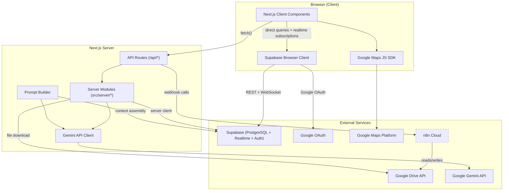

# Architecture Overview

## Tech Stack

| Layer | Technology |
|-------|-----------|
| Framework | Next.js 15 (App Router) |
| Language | TypeScript |
| Styling | Tailwind CSS |
| Database | Supabase (PostgreSQL + Realtime + Auth) |
| Auth | Google OAuth via Supabase Auth |
| Maps | Google Maps Platform (`@vis.gl/react-google-maps`) |
| AI / LLM | Google Gemini (`@google/generative-ai`) |
| Embeddings | Gemini `text-embedding-004` (768-d vectors) |
| Vector Search | pgvector extension in Supabase |
| Automation | n8n (webhook-based, being phased out) |
| Package Manager | pnpm |

---

## System Diagram



> **Dashed border on n8n** = being phased out. Document processing and report generation now happen directly in the Next.js server.

---

## Where Data Lives

### Supabase (Primary Store)

All persistent project data lives in Supabase PostgreSQL. See [database-schema.md](./database-schema.md) for the full schema.

| Table | Purpose |
|-------|---------|
| `projects` | Project metadata + subject info (JSONB) |
| `comparables` | Individual comp records (Land, Sales, Rentals) |
| `maps` | Map view state (center, zoom, drawings, overlays) |
| `map_markers` | Per-comp markers on maps (position, bubble, tail) |
| `page_locks` | Edit locking for concurrent users |
| `photo_analyses` | Subject photo metadata, AI labels, descriptions |
| `report_sections` | Generated report narrative content + embeddings |
| `report_section_history` | Version history for report sections |
| `project_documents` | Uploaded/ingested documents + AI extraction + embeddings |
| `knowledge_base` | Curated AI prompts/examples + embeddings |

### Google Drive (via n8n)

| Data | Format | Access Pattern |
|------|--------|---------------|
| Subject photos | Image files in Drive folder | n8n reads from Drive, processes, writes analysis to Supabase |
| `input.json` | JSON file in Drive | App exports photo labels to Drive via n8n for Google Apps Script |
| Comp folder contents | PDFs, images | n8n reads, parses, returns to app via webhook |

### Google Spreadsheet (Source of Truth for Comp Data)

The Google Spreadsheet remains the source of truth for:
- Raw subject data
- Comparable sales/land/rental data and adjustments
- Data formatting for Google Docs linking

The webapp reads comp data via n8n webhooks that query the spreadsheet.

---

## Authentication Flow

```mermaid
sequenceDiagram
    participant User
    participant Browser
    participant Middleware
    participant Supabase
    participant Google

    User->>Browser: Navigate to any page
    Browser->>Middleware: Request
    Middleware->>Supabase: getUser() (from cookies)
    alt No session
        Middleware-->>Browser: Redirect to /login
        User->>Browser: Click "Sign in with Google"
        Browser->>Supabase: signInWithOAuth({provider: 'google'})
        Supabase-->>Google: OAuth redirect
        Google-->>Browser: Auth code callback
        Browser->>Supabase: /auth/callback (exchange code)
        Supabase-->>Browser: Session cookie set
        Browser-->>User: Redirect to /projects
    else Has session
        Middleware-->>Browser: Allow request
    end
```



**Key files:**
- `src/middleware.ts` — Checks auth on every request, redirects unauthenticated users to `/login`
- `src/components/SupabaseAuthProvider.tsx` — Client-side auth context, Google OAuth trigger
- `src/app/auth/callback/route.ts` — Exchanges OAuth code for session
- `src/app/login/page.tsx` — Login page UI

---

## Service Integration Map

### What Calls Supabase Directly (from browser)

The browser Supabase client (`src/utils/supabase/client.ts`) is used by:

| Hook / Module | Tables Accessed |
|---------------|----------------|
| `useProject` | `projects`, `comparables`, `maps`, `map_markers` |
| `useProjectPhotos` | `photo_analyses` |
| `useReportSection` | `report_sections` |
| `usePresence` | `page_locks` + Supabase Realtime presence |
| `DocumentManager` | `project_documents` |
| `supabase-queries.ts` | All tables (CRUD + Realtime subscriptions) |

### What Calls Supabase from Server

Server Supabase client (`src/utils/supabase/server.ts`) is used by:

| Module | Purpose |
|--------|---------|
| `src/server/reports/actions.ts` | Read/write `report_sections`, `report_section_history` |
| `src/server/documents/actions.ts` | Read/write `project_documents` |
| `src/server/photos/actions.ts` | Read `photo_analyses` |
| `src/lib/prompt-builder.ts` | Read `knowledge_base`, `projects`, `project_documents`, `photo_analyses`, `report_sections` |
| `src/app/api/seed/*` | Write `knowledge_base`, `report_sections` |

### What Calls n8n (Still Active)

| API Route | n8n Endpoint | Purpose |
|-----------|-------------|---------|
| `POST /api/photos/process` | `/subject-photos-analyze` | Trigger photo analysis workflow |
| `POST /api/photos` | `/subject-photos-save-input` | Export `input.json` to Drive |
| `POST /api/comps-data` | `/comps-data` | Load comps + image map |
| `POST /api/comps-parser` | `/comps-parser` | Parse comp folder content |
| `POST /api/comps-folder-list` | `/comps-folder-list` | List comp subfolders |
| `POST /api/comps-folder-details` | `/comps-folder-details` | Get comp folder details |
| `POST /api/comps-exists` | `/comps-exists` | Check if comp exists in sheet |
| Cover page | `/subject-photo-data` | Refresh cover photo metadata |
| `projects/new` | `/projects-new`, `/project-data` | List/create projects from Drive |

### What Calls Gemini Directly (No n8n)

| Module | Gemini Feature | Model |
|--------|---------------|-------|
| `src/lib/gemini.ts` | Report generation, document extraction | `gemini-3.1-flash-lite-preview` |
| `src/lib/embeddings.ts` | Text embeddings | `text-embedding-004` |
| `src/app/api/seed/backfill-reports` | PDF section extraction | `gemini-3.1-flash-lite-preview` |

### What Calls Google Drive Directly

| Module | Purpose |
|--------|---------|
| `src/lib/drive-download.ts` | Download files by ID for document processing |

---

## Realtime Features

Supabase Realtime is used for live collaboration between users:

| Feature | Channel Type | What Updates |
|---------|-------------|-------------|
| Page locks | `postgres_changes` on `page_locks` | Lock/unlock editing per page |
| Photo grid | `postgres_changes` on `photo_analyses` | Live photo processing status, reordering |
| Report sections | `postgres_changes` on `report_sections` | Live content updates |
| Documents | `postgres_changes` on `project_documents` | Processing status updates |
| Presence | Supabase Realtime Presence | Who is on what page |

---

## Routing Structure

```
/login                          — Login page
/projects                       — Project list
/projects/new                   — Create project from Drive
/restore                        — Migrate localStorage data to Supabase
/project/seed                   — Seed tools (knowledge base, backfill)

/project/[projectId]/           — Project dashboard
  ├── cover/                    — Cover page (print layout)
  ├── neighborhood-map/         — Neighborhood map (drawing tools)
  ├── subject/
  │   ├── location-map/         — Subject location map
  │   └── photos/               — Subject photos (grid, labeling, AI analysis)
  ├── land-sales/
  │   ├── comparables/          — Land comp list
  │   ├── comparables-map/      — Land comps map
  │   └── comps/[compId]/location-map/  — Individual land comp map
  ├── sales/
  │   ├── comparables/          — Sales comp list
  │   ├── comparables-map/      — Sales comps map
  │   ├── comps/[compId]/location-map/  — Individual sales comp map
  │   └── ui/                   — Sales UI (prototype)
  ├── rentals/
  │   ├── comparables/          — Rentals comp list
  │   └── comparables-map/      — Rentals comps map
  ├── parser/[type]/            — Comp folder parser (n8n-powered)
  ├── reports/
  │   ├── neighborhood/         — Neighborhood narrative
  │   ├── zoning/               — Zoning narrative
  │   ├── subject-site-summary/ — Subject site summary
  │   ├── highest-best-use/     — Highest & best use
  │   └── ownership/            — Ownership history
  └── documents/                — Document manager (upload, AI extraction)
```
