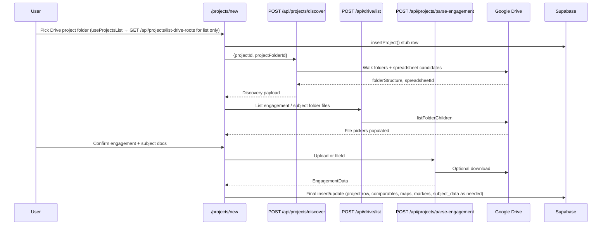
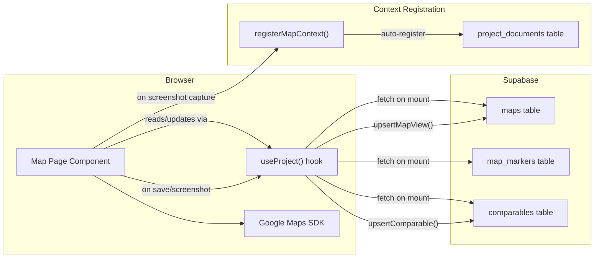
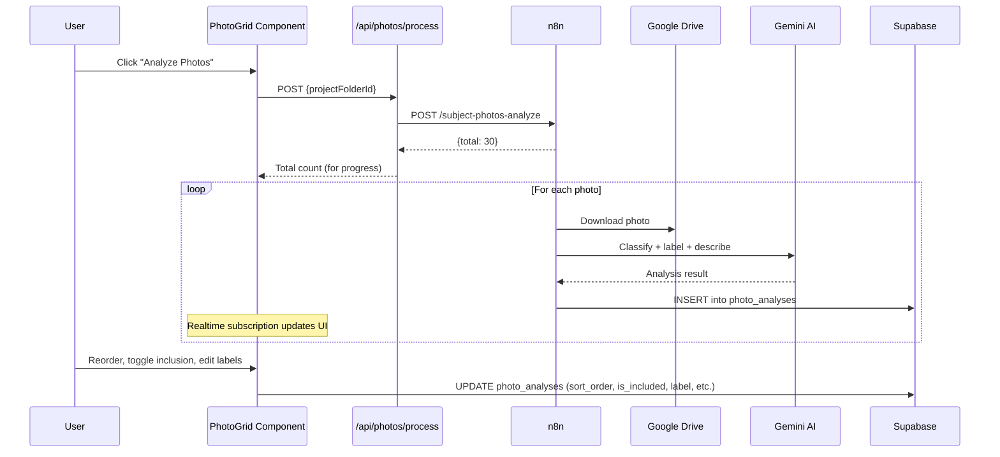
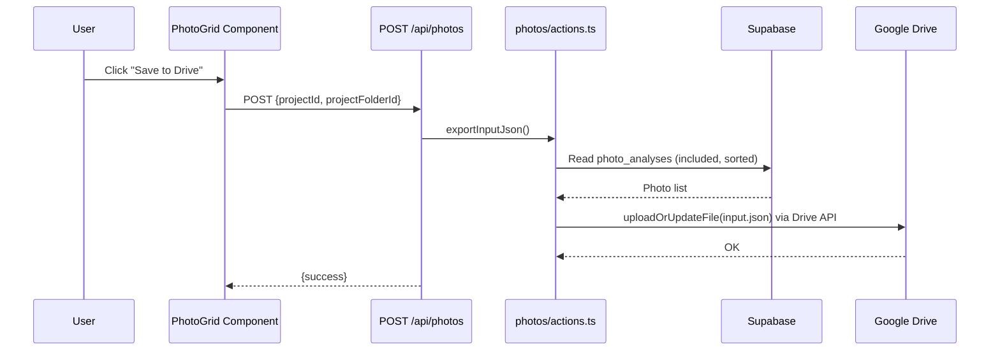
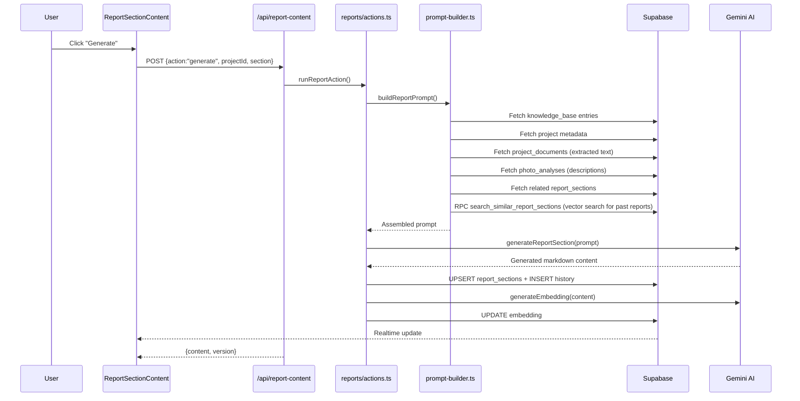
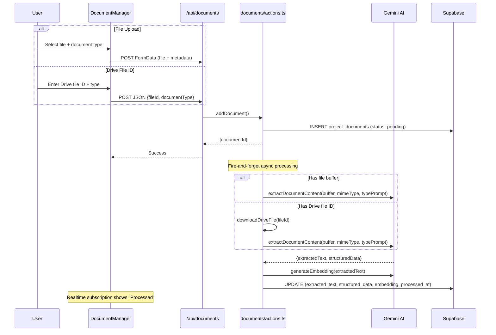
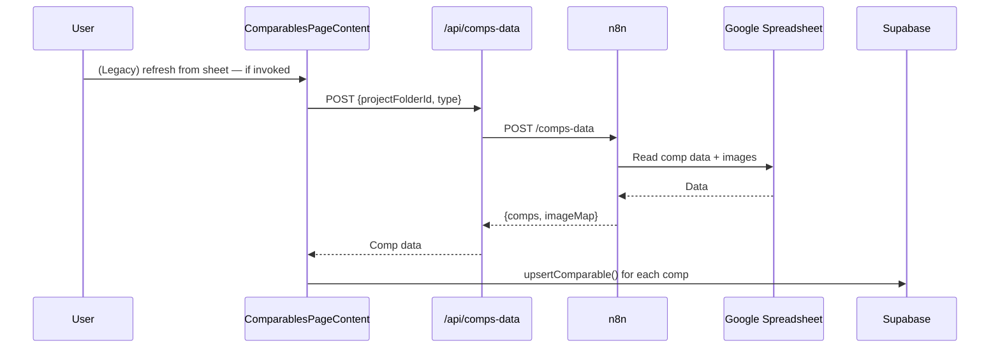
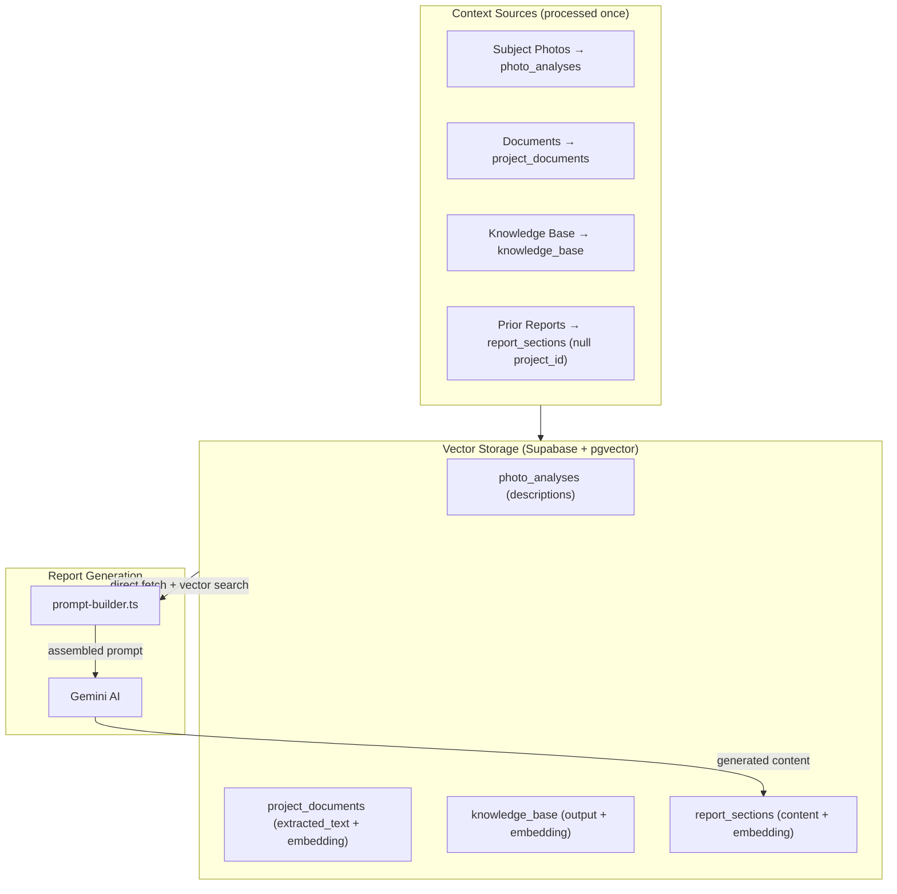

# Data Flow by Feature

This document describes how data moves through the system for each major feature area.

---

## 1. Project Management

### Create Project

**Data stored:** Primarily `projects` (metadata + `folder_structure`), `comparables`, `maps`, `map_markers`, and `subject_data` as the wizard completes.

**n8n dependency:** **None** for this flow. The folder picker list comes from `GET /api/projects/list-drive-roots` (Drive API with the signed-in user’s token; parent folder ID from `GOOGLE_DRIVE_APPRAISAL_PROJECTS_PARENT_FOLDER_ID`). Discover, Drive list, engagement/flood parsing, and Supabase persistence are all in-app.

### Restore from localStorage

The `/restore` page allows migrating legacy `localStorage` data into Supabase via `insertProject()`. This is a one-time migration path.

---

## 2. Maps

### Map Types

| Map Type | Route | Purpose |
|----------|-------|---------|
| `neighborhood` | `/project/[id]/neighborhood-map` | Neighborhood boundary map with drawing tools |
| `subject-location` | `/project/[id]/subject/location-map` | Subject property location map |
| `land` | `/project/[id]/land-sales/comparables-map` | Land comparables map |
| `sales` | `/project/[id]/sales/comparables-map` | Sales comparables map |
| `rentals` | `/project/[id]/rentals/comparables-map` | Rentals comparables map |
| `comp-location` | `/project/[id]/*/comps/[compId]/location-map` | Individual comp aerial view |

### Map Data Flow

**All map data is stored in Supabase** via the `useProject` hook. Changes are persisted on save. No n8n involvement.

**Context registration:** When a neighborhood or location map screenshot is captured, `registerMapContext()` automatically creates a `project_documents` row (if one doesn't already exist for that map type) so the map is available as context for AI report generation.

### Drawing Tools

Drawing tools (polygon, circle, polyline, street labels) store their data in the `maps.drawings` JSONB column. Each map has its own independent set of drawings.

---

## 3. Subject Photos

### Photo Processing Pipeline

**n8n dependency:** Required for photo analysis (downloads from Drive, sends to Gemini, writes to Supabase).

**Realtime:** `photo_analyses` table broadcasts changes so both users see live updates.

### Photo Export (input.json)

**Purpose:** The `input.json` file in Google Drive is consumed by Google Apps Script to insert images into the final Google Doc report.

**n8n dependency:** None — export is fully server-side with the user’s Drive token.

---

## 4. Report Content Generation

### Generate a Report Section

**Key insight:** Report generation is fully server-side with **no n8n involvement**. The prompt builder assembles context from multiple Supabase tables and similar past reports (via vector search), then Gemini generates the narrative.

### Edit and Save

Manual edits go directly to Supabase via the `useReportSection` hook. Each save creates a history record and increments the version.

---

## 5. Document Processing

### Upload and Process a Document

**No n8n involvement.** Document processing happens entirely in the Next.js server using Gemini for extraction and embedding generation.

**Type-specific prompts** (`src/lib/document-prompts.ts`) instruct Gemini to extract domain-specific fields based on document type (deed, flood map, CAD, etc.).

---

## 6. Comparables Data

### Refresh Comps from Spreadsheet

**n8n dependency:** Only this spreadsheet read path. The main comp UX is Supabase-backed (`comparables` + `comp_parsed_data`).

### Comp Parser (in-app)

Adding or re-parsing a comp uses the **webapp**, not n8n:

1. **Folder listing / metadata:** `POST /api/comps-folder-list` and `POST /api/comps-folder-details` → `drive-api.ts`.
2. **AI extraction:** `POST /api/comps/parse` → `comp-parser.ts` (Drive download + Gemini) → persists to `comp_parsed_data`.
3. **Duplicate check (optional):** `POST /api/comps-exists` → n8n (Spreadsheet query) — still n8n today.

UI entry points include `CompAddFlow`, comp detail routes under `land-sales/comps/[compId]`, `sales/comps/[compId]`, and `rentals/comps/[compId]`, plus `CompUITemplate` for template-style comp pages.

---

## 7. AI Context Pipeline (Process-Once, Query-Many)

**Philosophy:** Each piece of project context (photos, documents, maps) is processed once and stored with embeddings. When generating report content, the prompt builder gathers all relevant context from Supabase (including vector similarity search for past reports) and assembles a single comprehensive prompt for Gemini.

---

## Summary: n8n vs Direct

| Feature | n8n | Direct (Supabase/Gemini/Drive) |
|---------|-----|----------------------------------|
| Project creation | | **Direct** — picker: `GET /api/projects/list-drive-roots`; after selection: discover + Drive list + engagement parse |
| Cover photo data | | **Direct** (`POST /api/cover-data`) |
| Photo analysis | **Yes** (`/subject-photos-analyze`) | |
| Photo export (input.json) | | **Direct** (`exportInputJson` → Drive API) |
| Comp data refresh | **Yes** (`/comps-data`) | |
| Comp parser | | **Direct** (`POST /api/comps/parse`) |
| Comp folder list/details | | **Direct** (Drive API) |
| Comp duplicate check | **Yes** (`/comps-exists`) | |
| Report generation | | **Direct** (Gemini + Supabase) |
| Document processing | | **Direct** (upload/Drive → Gemini → Supabase) |
| Seed/backfill | | **Direct** (local files → Gemini → Supabase) |
| Map state | | **Direct** (Supabase only) |
| Auth | | **Direct** (Supabase Auth + Google OAuth) |
| Realtime collaboration | | **Direct** (Supabase Realtime) |
